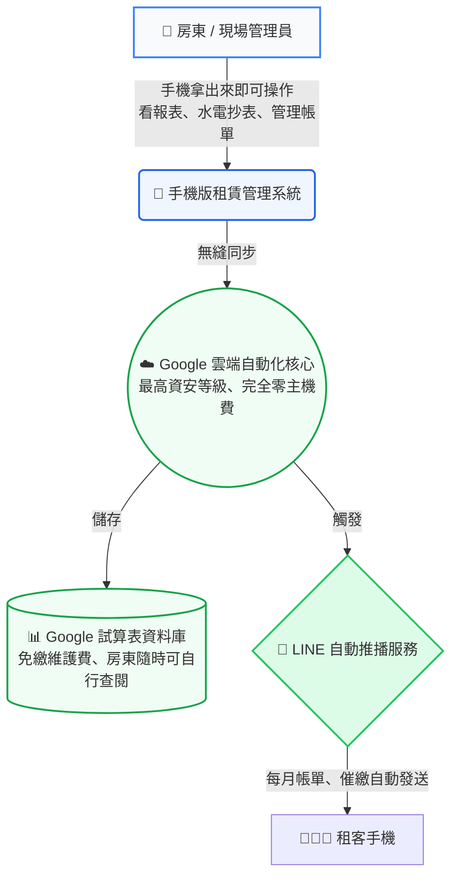

# 租賃管理行動後台

手機優先的租賃管理系統前端，供屋主、管理夥伴、現場人員使用。

## 系統架構與特色



### 三大核心賣點：
1. **完全沒有主機維護費**：資料庫架設於 Google 試算表上，免除每月伺服器租金，房東也能隨時打開 Google 表格直觀看帳。
2. **手機就是管理後台**：現場人員無需攜帶電腦，水電抄表拿手機點幾下即完成，老闆隨時隨地都能看營收報表。
3. **LINE 全自動催繳**：系統自動發送帳單至租客 LINE 中，省去人工催收與列印紙本的麻煩，也不怕租客漏接訊息。

## 快速開始

1. 直接雙擊 `index.html` 即可在瀏覽器預覽（使用 Mock 模擬資料）
2. 或部署到 GitHub Pages / Netlify / Cloudflare Pages

## 連接你的 GAS API

打開 `app.js`，找到第 8 行，填入你的 GAS Web App 網址：

```js
const GAS_WEB_APP_URL = 'https://script.google.com/macros/s/你的ID/exec';
```

## GAS API 格式

**GET（讀取全部資料）**
```
GET: GAS_WEB_APP_URL?action=getAll
回傳: { rooms:[], tenants:[], meters:[], invoices:[], tasks:[] }
```

**POST（新增 / 修改）**
```json
{ "action": "upsert", "table": "tenants", "payload": { ...欄位 } }
```

**DELETE（刪除）**
```json
{ "action": "delete", "table": "rooms", "id": "xxx" }
```

## 直連 Google Sheets（JSONP 模式）

在 `app.js` 找到 `SPREADSHEET_ID`，填入你的試算表 ID。
將試算表共用設定為「知道連結的人均可檢視」即可自動讀取真實資料。

## 檔案結構

```
├── index.html   # 主頁面（所有頁面區塊）
├── style.css    # 樣式（Mobile-First）
├── app.js       # 主程式邏輯
├── data.js      # Mock 模擬資料
└── README.md    # 本說明文件
```

## 功能頁面

| 頁面 | 功能 |
|------|------|
| 儀表板 | KPI 總覽、警示、快速看板 |
| 房間管理 | 格狀/列表切換、篩選、館別分群 |
| 房客管理 | 列表、LINE綁定狀態、**新增房客** |
| 帳單管理 | 未繳名單、**一鍵標記已繳** |
| 水電紀錄 | 電表列表、**新增電表讀數**（預留照片欄位）|
| 報修管理 | 卡片式狀態看板 |
| 合約管理 | 到期提醒、**標記已聯絡** |
| 月報表 | 營收圖表、館別分布 |
| 可承租房間 | 空房列表 |

## 待辦（未來擴充）

- [ ] 登入權限（程式結構已預留）
- [ ] 電表照片上傳
- [ ] LINE 推播整合
- [ ] 新增 / 修改房間管理 CRUD
- [ ] 匯出報表 CSV
